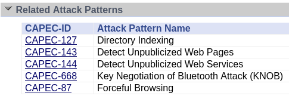

# PPS-Unidad2Actividad1-PabloGilGalapero

# Trazado de una vulnerabilidad.
Actividad 1 de la Unidad 2 de Puesta en Producción Segura. Tabajaremos con los Entornos de Desarrollo

Tenemos un claro objetivo:

[Obtener información de una vulnerabilidad navegando por las webs de los organismos que mantienen esas listas.](#Trazado)

[Analizar las debilidades que la conforman](#Debilidades).

[Encontrar los patrones de ataque empleados](#Patrones).

## Trazado

Vamos a realizar el trazado de la vulnerabilidad contenida en el [artículo de INCIBE](https://www.incibe.es/empresas/avisos/vulnerabilidad-critica-de-omision-de-autenticacion-en-goanywhere-mft-de-fortra)

Podemos ver una descripción general sobre la vulnerabilidad: **"Se ha detectado una vulnerabilidad de severidad crítica en GoAnywhere MFT de Fortra que podría permitir a un ciberdelincuente crear un usuario administrador a través del portal de administración."**

Si deslizamos hacia abajo podemos encontrar una referencia a la página de Fortre donde hay más información sobre lo que buscamos

Localizamos la vulnerabilidad que estamos buscando

## Información sobre CVE-2024-0204

Si copiamos la vulnerabilidad y nos dirigimos a la página oficial de NIST, podemos encontrar [información ampliada](https://nvd.nist.gov/vuln/search/results?form_type=Basic&results_type=overview&query=CVE-2024-0204&search_type=all&isCpeNameSearch=false)

_Lo primero que nos salta a la vista es la organización a la que afecta y una nota que califica el impacto de la vulneravilidad_

### Vector de ataque

Si mantenemos el cursor encima del vector de ataque se despliega una ventana con información acerca de los valores utilizados para explotarla

## Debilidades 

El siguiente paso natural es indentificar las debilidades explotadas para descubrir la vulnerabilidad

Si pinchamos en la debilidad nos va a redirigir a la [página del MITRE](https://cwe.mitre.org/data/definitions/425.html)

Como podemos ver se trata de un caso en el que la aplicación web no aplica adecuadamente, valga la redundancia, la autorización apropiada en las URL restringidas, scripts o archivos restringidos.

MIST nos muestra información como: 

- Ramas parentales (de dónde proviene la debilidad)

#### CWE-288

Si clicamos encima de la debilidad de la que proviene, en este caso se trata de CWE-288, nos redirige a otro apartado [dentro de MITRE](https://cwe.mitre.org/data/definitions/288.html) donde encontramos información acerca de ella

## Patrones de ataque relacionados

Si continuamos desgranando la vulnerabilidad paso por paso nos vamos a topar con los patrones de ataque.

Tal y como podemos apreciar, el patron de ataque utilizado para explotar la vulneravilidad trazada es CAPEC-87. Pulsando encima nos redirige a [CAPEC](https://capec.mitre.org/data/definitions/87.html)

Se trata de un patrón que comienza con un atacante utilizando la navegación forzada (ingreso directo de URLs) para acceder a partes de un sitio web que normalmente están inaccesibles. Por lo general, se emplea un controlador frontal o un patrón de diseño similar para proteger el acceso a ciertas secciones de una aplicación web. La navegación forzada permite al atacante acceder a información, realizar operaciones privilegiadas y entrar a áreas de la aplicación web que no están protegidas correctamente.

_Deslizando encontramos el execution flow donde nos habla de los pasos y técnicas para llevarlo a cabo_

